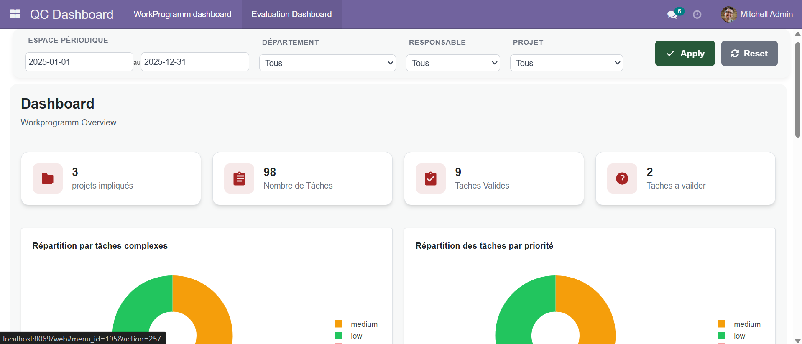
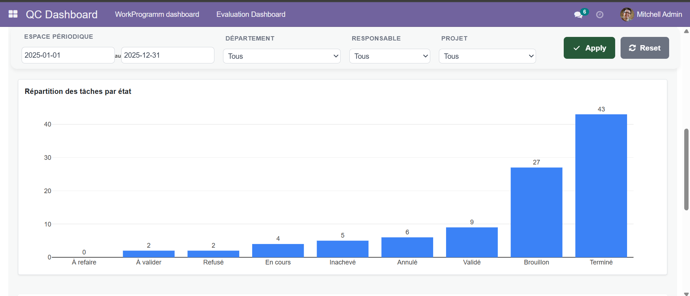
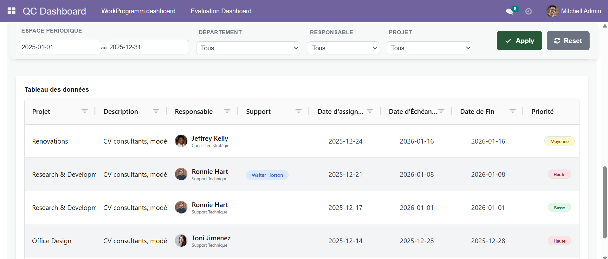
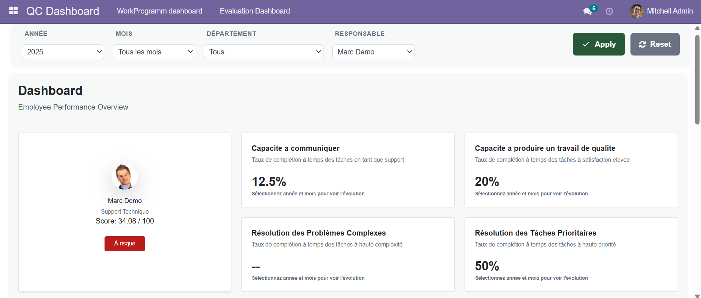
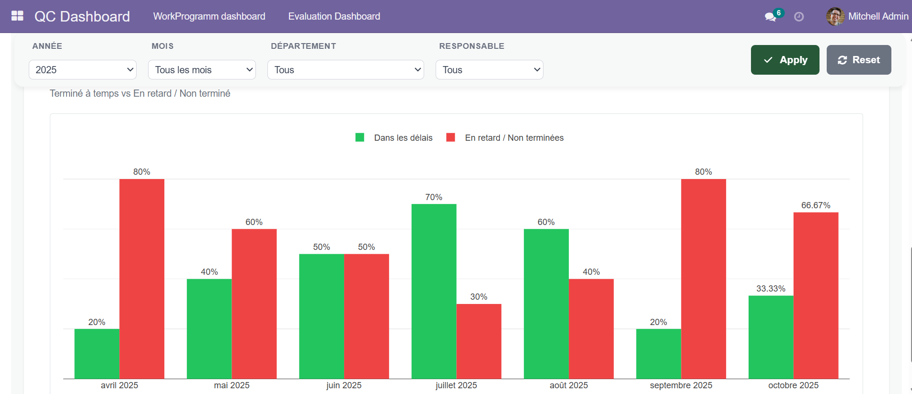

# WorkProgramm – Task Tracking & Team Management

*A modern web application for task management with multiple views, an analytical dashboard, and a performance evaluation module.*

---

## 📋 Project Overview

**WorkProgramm** is a complete solution for **task tracking and team management**.  
It combines **flexibility**, **visibility and control**, along with an **objective evaluation system**, allowing managers to **supervise, analyze, and improve the productivity** of their team members.

---

## ✨ Main Features

### 1. **WorkProgramm Module** – Task Management  
Create, assign, and track your tasks simply and efficiently.

| View | Description |
|------|-------------|
| 📝 **Form View** | Intuitive creation and editing of tasks with customizable fields (priority, deadlines, assignment, comments). |
| 🗂️ **Kanban** | Drag-and-drop column view (To Do, In Progress, Done) offering a clear visualization of progress. |

> *Form & Kanban Example*  
>   
> 

---

### 2. **Manager Dashboard** – Real-Time Monitoring  
A powerful dashboard to supervise all team activity.

- 📊 **Overview**: Number of tasks by status, project, or employee.  
- ⏱️ **Deadline Tracking**: Alerts for overdue or upcoming tasks.  
- 👥 **Workload**: Balanced distribution of tasks per team member.  
- 📈 **Key Indicators**: Productivity, completion rate, average time per task.

>   
> >   
> > 

---

### 3. **Evaluation Dashboard** – Objective Performance  
Assess employees based on precise and measurable criteria.

- ✅ **Task Score**: Completion, on-time delivery, and quality via feedback.  
- 🌟 **Overall Evaluation**: Automatic monthly rating + qualitative comments.  
- 🏆 **Team Ranking**: Comparative view (anonymized or named).  
- 📅 **Performance History**: Track evolution over time.

> *Ideal for reviews, bonuses, or development plans.*  
> >   
> > 

---

## 🎯 Target Audience

| User | Benefits |
|------|----------|
| **Managers** | Clear visibility, accurate tracking, and easier supervision |
| **Teams** | Intuitive and collaborative interface |
| **HR** | Reliable data for evaluation and skill development |

---

## 🛠️ Technologies Used

- **Frontend**: owl + Tailwind CSS + aggrid  
- **Backend**: odoo  
- **Database**: PostgreSQL  
- **Charts**: plotly  
