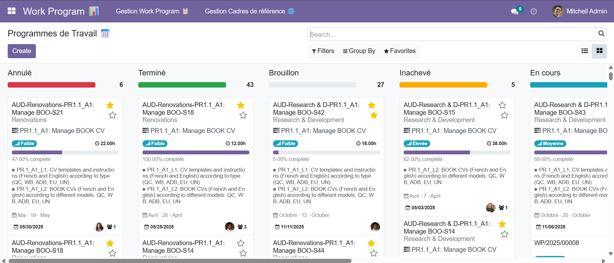
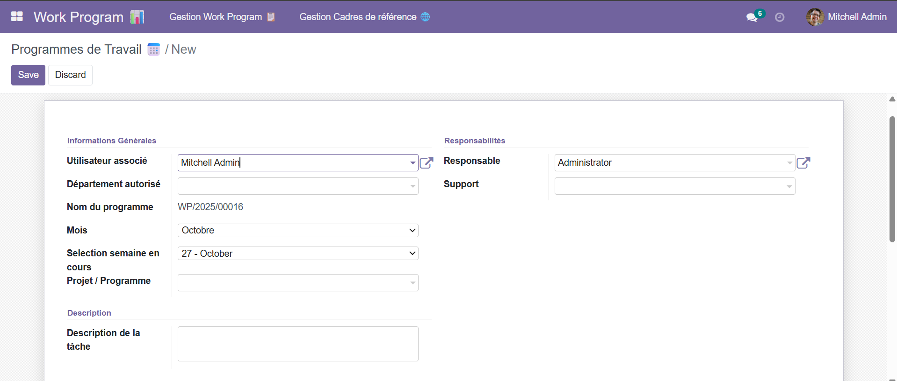

# WorkProgramm – Suivi de Tâches & Gestion d'Équipe

*Application web moderne de gestion de tâches avec vues multiples, dashboard analytique et module d'évaluation des performances.*

---

## 📋 Aperçu du Projet

**WorkProgramm** est une solution complète pour le **suivi des tâches et la gestion des équipes**.  
Elle combine **flexibilité**, **visibilité et contrôle**, ainsi qu’un **système d’évaluation objectif**, permettant aux managers de **superviser, analyser et améliorer la productivité** de leurs collaborateurs.

---

## ✨ Fonctionnalités Principales

### 1. **Module WorkProgramm** – Gestion des Tâches
Créez, assignez et suivez vos tâches de manière simple et efficace.  

| Vue | Description |
|-----|------------|
| 📝 **Formulaire** | Création et modification intuitive des tâches avec champs personnalisables (priorité, deadlines, assignation, commentaires). |
| 🗂️ **Kanban** | Vue drag-and-drop par colonnes (À faire, En cours, Terminé), offrant une visualisation claire de l’avancement. |

> *Exemple Formulaire & Kanban*  
>   
> 

---

### 2. **Dashboard Manager** – Pilotage en Temps Réel
Un tableau de bord puissant pour superviser toute l’activité de l’équipe.

- 📊 **Vue d’ensemble** : Nombre de tâches par statut, projet ou employé.  
- ⏱️ **Suivi des délais** : Alertes pour les tâches en retard ou à venir.  
- 👥 **Charge de travail** : Répartition équilibrée des tâches par membre de l’équipe.  
- 📈 **Indicateurs clés** : Productivité, taux de complétion, temps moyen par tâche.

> 

---

### 3. **Dashboard Évaluation** – Performance Objective
Évaluez les employés sur des critères précis et mesurables.  

- ✅ **Score par tâche** : Complétion, respect des délais, qualité via feedback.  
- 🌟 **Évaluation globale** : Note mensuelle automatique + commentaires qualitatifs.  
- 🏆 **Classement d’équipe** : Vue comparative (anonymisée ou nominative).  
- 📅 **Historique des performances** : Suivi de l’évolution dans le temps.

> *Idéal pour les entretiens, primes ou plans de développement.*

---

## 🎯 Public Cible

| Utilisateur | Bénéfices |
|------------|-----------|
| **Managers** | Vision claire, suivi précis et pilotage facilité |
| **Équipes** | Interface intuitive et collaborative |
| **RH** | Données fiables pour évaluation et développement des compétences |

---

## 🛠️ Technologies Utilisées

- **Frontend** : owl + Tailwind CSS  + aggrid
- **Backend** : odoo 
- **Base de données** : PostgreSQL  
- **Graphiques** : plotly 
-

---

